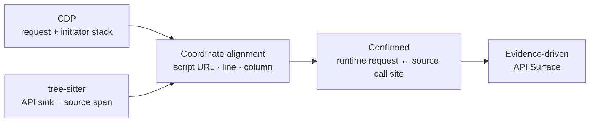

<div align="center">

# TraceSurface

**Map real browser requests back to API call sites in frontend source code.**

Evidence-driven frontend API discovery, inference, and verification.

English · [简体中文](./README.md)


</div>

TraceSurface collects evidence from browser runtime traffic, frontend artifacts, and JavaScript ASTs to reconstruct a site's API surface. Every result records where it came from, how it was bound, and why stronger evidence was unavailable—instead of returning an opaque list of guessed URLs.

## Why TraceSurface

- **Runtime evidence**: capture Fetch/XHR traffic, responses, and JavaScript initiator stacks through Playwright and CDP.
- **Static call-site discovery**: analyze `fetch`, XHR, axios, object configs, custom wrappers, and split gateway wrappers with tree-sitter.
- **Explainable deterministic inference**: combine baseURL facts, a client identity graph, and bounded fan-out without arbitrarily selecting one candidate.
- **Local evidence report**: inspect every result through API Surface, Verification, Network, and Secrets views.

## The Core Idea: Stack-to-AST Alignment

Static frontend analysis can find a call site without knowing its final runtime URL. Network capture can observe a real request without explaining which source expression initiated it. TraceSurface connects the two through the initiator stack.



1. CDP records the script URL, line, and column of initiator frames for each real Fetch/XHR request.
2. tree-sitter extracts API call sites with precise source spans.
3. A frame and a call site are aligned when the frame coordinate falls within the call site's span in the same script.
4. Confirmed requests become the strongest evidence and anchor baseURL binding for unresolved static candidates.

Runtime truth is no longer side-channel traffic—it directly calibrates static analysis.

## Quick Start

TraceSurface requires Python 3.12, [uv](https://docs.astral.sh/uv/), and Node.js 20+.

```bash
git clone https://github.com/pis10/TraceSurface.git
cd TraceSurface

uv sync
uv run playwright install chromium

cd frontend
npm ci
npm run build
cd ..

uv run tracesurface scan https://example.com --no-replay
uv run tracesurface serve
```

The report is served at `http://127.0.0.1:8765` by default.

## Common Commands

```bash
uv run tracesurface scan https://example.com
uv run tracesurface scan https://example.com --no-replay
uv run tracesurface scan -f targets.txt -s 10
uv run tracesurface scan https://example.com --headed --wait-ms 15000
uv run tracesurface login https://sso.example.com
uv run tracesurface serve
```

`login` stores Playwright `storage_state` and optional `sessionStorage` in `~/.tracesurface/auth.json`. Later scans load it automatically. Active replay never copies Cookie, Authorization, or other captured authentication headers.

## Pipeline

```text
URL
 └─ Collection   browser / CDP / routes / artifacts / micro-frontends
     └─ Extraction   JavaScript / HTML AST → request, base, alias, and secret facts
         └─ Inference   stack alignment / value graph / client identity graph → L1–L4
             └─ Storage   SQLite evidence model
                 └─ Replay   unauthenticated replay with evidence links
```

### Evidence Tiers

| Tier | Meaning |
| --- | --- |
| **L1 Full** | CDP-confirmed, uniquely identity-bound, or already a full URL in source |
| **L2 Bound** | Bound through the client identity graph or deterministic bounded fan-out |
| **L3 Global** | Falls back to the set of base URLs already discovered on the site |
| **L4 Origin** | Falls back to the target origin with the weakest evidence |

Every non-L1 result carries `why_not_higher_tier`, explaining which stronger evidence was missing.

## Data and Report

Data is stored in `~/.tracesurface/` by default. Set `TRACESURFACE_HOME` to use another location.

| View | Contents |
| --- | --- |
| **API Surface** | Resolved APIs, evidence tiers, base sources, and call sites |
| **Verification** | Active replay status, requests, and responses |
| **Network** | Real browser Fetch/XHR traffic and initiator stacks |
| **Secrets** | Sensitive information found in frontend artifacts, with context |

## Stack

- Python, Typer, asyncio, httpx
- Playwright and Chrome DevTools Protocol
- tree-sitter and tree-sitter-javascript
- SQLite, FastAPI, and Uvicorn
- React, TypeScript, Vite, and Tailwind CSS

## Safety and Authorization

Use TraceSurface only on targets you own or are explicitly authorized to assess. Scans perform active replay by default, and `POST` or unknown methods may change data on the target system. Use `--no-replay` for discovery-only runs.

## License

[MIT](./LICENSE)
