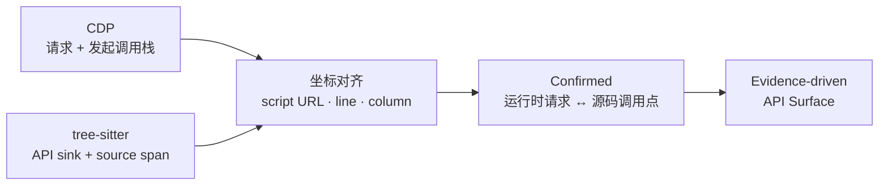

<div align="center">

# TraceSurface

**把浏览器里的真实请求，对齐回前端源码中的 API 调用点。**

证据驱动的前端 API 发现、推导与验证工具。

[English](./README.en.md) · 简体中文


</div>

TraceSurface 从浏览器运行时、前端产物与 JavaScript AST 中收集证据，尽可能还原一个站点的 API 面。每条结果都记录它从哪里来、如何绑定，以及为什么没有进入更高置信层级，便于逐条复查，而不是只输出一份无法解释的 URL 列表。

## 为什么是 TraceSurface

- **真实运行时证据**：通过 Playwright/CDP 捕获 Fetch/XHR、响应与 JavaScript 发起调用栈。
- **静态调用点发现**：用 tree-sitter 分析 `fetch`、XHR、axios、对象配置、自定义 wrapper 与拆参网关 wrapper。
- **可解释的确定性推导**：结合 baseURL 事实、client 身份图与有限集扇出生成完整 URL，不在多个候选中随意挑选。
- **本地证据报告**：在 API Surface、Verification、Network 与 Secrets 视图中追溯每条结果。

## 核心思路：Stack-to-AST Alignment

前端静态分析常常能找到调用点，却不知道它在运行时最终请求了哪个 URL；网络抓包能看到真实请求，却很难说明它来自源码中的哪一处。TraceSurface 用调用栈把两者接起来。



1. CDP 为每条真实 Fetch/XHR 保存发起栈帧的脚本 URL、行号和列号。
2. tree-sitter 提取 API 调用点，并记录它在源码中的精确位置区间。
3. 当栈帧坐标落入同一脚本的调用点区间时，两者被认定为同一处调用。
4. 已确认请求成为最强证据，继续为静态候选的 baseURL 绑定与分层推导提供锚点。

这让运行时事实不再只是旁路流量，而能直接校准静态分析结果。

## 快速开始

要求 Python 3.12、[uv](https://docs.astral.sh/uv/) 和 Node.js 20+。

```bash
git clone https://github.com/pis10/TraceSurface.git
cd TraceSurface

uv sync
uv run playwright install chromium

cd frontend
npm ci
npm run build
cd ..

uv run tracesurface scan https://example.com --no-replay
uv run tracesurface serve
```

报告默认位于 `http://127.0.0.1:8765`。

## 常用命令

```bash
uv run tracesurface scan https://example.com
uv run tracesurface scan https://example.com --no-replay
uv run tracesurface scan -f targets.txt -s 10
uv run tracesurface scan https://example.com --headed --wait-ms 15000
uv run tracesurface login https://sso.example.com
uv run tracesurface serve
```

`login` 会把 Playwright `storage_state` 和可选的 `sessionStorage` 保存到 `~/.tracesurface/auth.json`。后续扫描默认加载该登录态；主动重放不会复制 Cookie、Authorization 等认证头。

## 处理流程

```text
URL
 └─ Collection   浏览器 / CDP / 路由 / 前端产物 / 微前端
     └─ Extraction   JavaScript / HTML AST → request、base、alias、secret facts
         └─ Inference   栈对齐 / 值解析图 / client 身份图 → L1–L4
             └─ Storage   SQLite 证据模型
                 └─ Replay   无认证重放与结果回链
```

### 证据层级

| 层级 | 含义 |
| --- | --- |
| **L1 Full** | CDP 运行时确认、唯一身份绑定，或源码中存在完整 URL |
| **L2 Bound** | client 身份图绑定，或确定性的有限候选扇出 |
| **L3 Global** | 使用站点内已经发现的 baseURL 集合回退推导 |
| **L4 Origin** | 仅能使用目标站点 origin，证据最弱 |

未进入 L1 的结果会携带 `why_not_higher_tier`，说明本次推导缺少了哪一类更强证据。

## 数据与报告

数据默认保存在 `~/.tracesurface/`，也可以通过 `TRACESURFACE_HOME` 指定其他目录。

| 视图 | 内容 |
| --- | --- |
| **API Surface** | 完整 API 面、证据层级、base 来源与调用点 |
| **Verification** | 主动重放状态、请求与响应详情 |
| **Network** | 浏览器真实 Fetch/XHR 与调用栈 |
| **Secrets** | 前端产物中的敏感信息命中与上下文 |

## 技术栈

- Python、Typer、asyncio、httpx
- Playwright、Chrome DevTools Protocol
- tree-sitter、tree-sitter-javascript
- SQLite、FastAPI、Uvicorn
- React、TypeScript、Vite、Tailwind CSS

## 安全与授权

TraceSurface 只应用于你拥有或已获得明确授权的目标。扫描默认会执行主动重放，其中 `POST` 或未知方法可能改变目标系统的数据；仅做发现时请使用 `--no-replay`。

## License

[MIT](./LICENSE)
